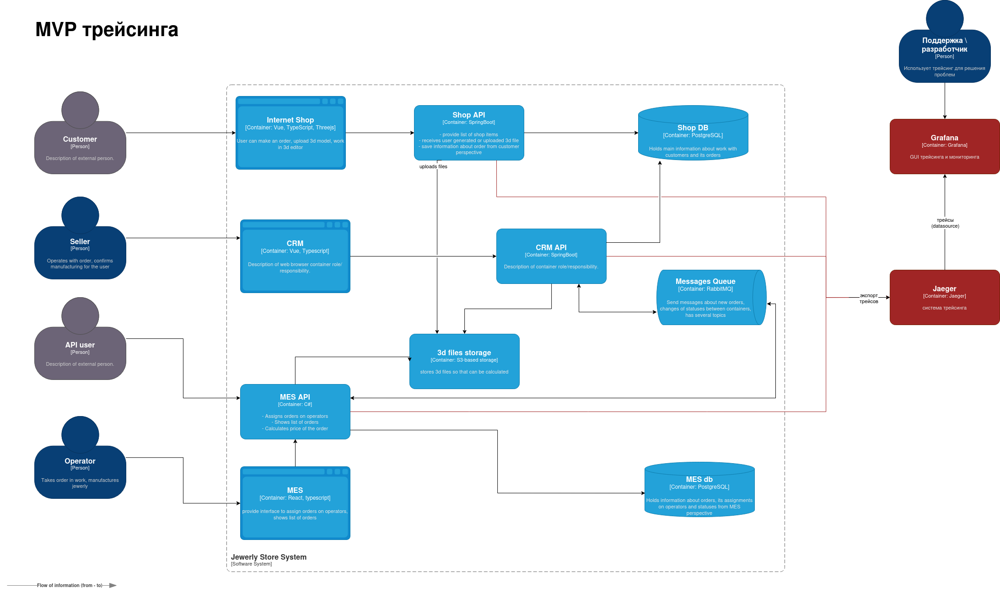
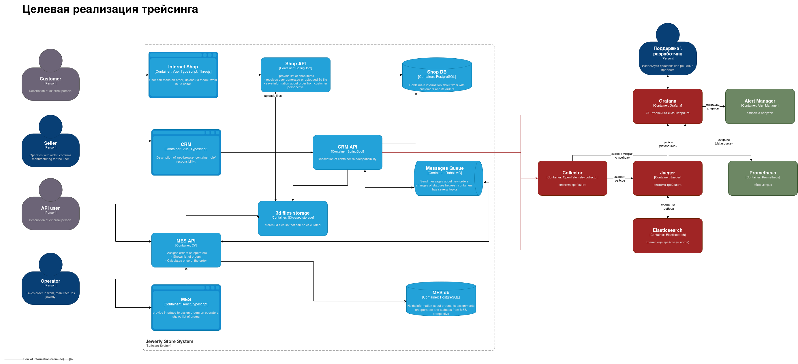

# Архитектурное решение по трейсингу

## Мотивация

**Проблема:** Заказы "зависают" в непонятном состоянии, теряются сообщения между сервисами. Команда не может понять, где именно заказ и что с ним произошло.

**Что даст трейсинг:**
- Полная видимость пути заказа через все системы
- Быстрое выявление места сбоя
- Понимание времени обработки на каждом этапе

**Метрики, на которые повлияет внедрение:**

| Метрика | Тип | Ожидаемый эффект |
|---------|-----|------------------|
| MTTD (время обнаружения проблемы) | Техническая | Снижение с часов/дней до минут |
| MTTR (время восстановления) | Техническая | Снижение за счёт быстрой локализации |
| % "потерянных" заказов | Бизнес | Снижение за счёт раннего обнаружения |
| Время обработки заказа | Бизнес | Оптимизация за счёт выявления узких мест |
| Удовлетворённость клиентов | Бизнес | Рост за счёт проактивного решения проблем |

**Критические точки:**
1. **RabbitMQ** — потеря сообщений, переполнение очереди
2. **MES API (расчёт стоимости)** — таймаут при обработке сложных моделей (до 30 мин)
3. **MES API (внешний API)** — ошибки от партнёров, rate limiting
4. **CRM API** — ошибки при создании/обновлении заказа
5. **Shop API → S3** — ошибка загрузки 3D-файла
6. **MES API → S3** — ошибка чтения файла для расчёта

---

## Предлагаемое решение

### Поэтапное внедрение

**Этап 1 (MVP):** Сервисы отправляют трейсы напрямую в Jaeger  
**Этап 2:** Добавить OTel Collector для буферизации, семплирования, обогащения

Переход между этапами — только смена endpoint в конфиге приложений. Код приложений не меняется.

### Технологический стек

| Компонент | MVP | Полная версия | Обоснование |
|-----------|-----|---------------|-------------|
| Стандарт | OpenTelemetry | OpenTelemetry | Vendor-neutral, поддержка Java и C# |
| Collector | нет | OTel Collector | Буферизация, семплирование (добавляем позже) |
| Backend | Jaeger | Jaeger | Open-source, хорошая интеграция с OTel |
| Хранилище | Встроенное (Badger) | Elasticsearch | Для MVP хватит встроенного хранилища |
| UI и алертинг | **Grafana** | **Grafana** | **Уже используется для мониторинга — единый интерфейс, корреляция метрик и трейсов** |

**Почему Grafana вместо Jaeger UI:**
- ✅ Уже развёрнут для мониторинга 
- ✅ Единый интерфейс для метрик и трейсов
- ✅ Корреляция: можно перейти от метрики к трейсу и наоборот
- ✅ Единая система алертинга 
- ✅ Меньше компонентов для поддержки
- ✅ Grafana имеет встроенную поддержку Jaeger как datasource

### Мониторинг и алертинг на основе трейсинга

**Grafana как единый интерфейс:**
- Jaeger datasource в Grafana для просмотра трейсов
- Корреляция: из дашборда с метриками можно перейти к трейсам по `trace_id`
- Встроенные панели для анализа трейсов (Trace view, Service map)

**Метрики из трейсов:**
- Jaeger экспортирует метрики в Prometheus (встроенная функция)
- Метрики доступны в Grafana:
  - `jaeger_traces_total` — количество трейсов
  - `jaeger_spans_total` — количество span'ов
  - `jaeger_operation_duration` — длительность операций

### Автоматический мониторинг процесса прохождения заказа

**Отслеживание жизненного цикла заказа через трейсы:**

1. **Генерация метрик из трейсов (OTel Collector):**
   - Collector анализирует входящие трейсы и генерирует метрики:
     - `order_trace_duration_seconds{order_id, status}` — время обработки заказа
     - `order_span_count{order_id, service}` — количество span'ов на сервис
     - `order_status_transitions_total{order_id, from_status, to_status}` — переходы статусов
     - `order_errors_total{order_id, service, error_type}` — ошибки по заказам

2. **Детекция "зависших" заказов:**
   - Метрика: `order_last_span_timestamp{order_id, current_status}` — время последнего span'а с учётом текущего статуса
   - Алерт с учётом нормального времени для этапа:
     - Если `now() - order_last_span_timestamp > threshold_for_status` и статус не `CLOSED` → заказ завис
     - Пороги зависят от статуса и будут определены по согласованию с бизнесом (например, для `MANUFACTURING_STARTED` нормально несколько дней/недель, для `SUBMITTED` — минуты/часы)
   - Запрос к Jaeger API по `order_id` для получения полного трейса и анализа причины задержки

3. **Мониторинг этапов обработки:**
   - Отслеживание времени на каждом этапе через span'ы:
     - `order_stage_duration{order_id, stage}` где stage = `submitted`, `price_calculation`, `manufacturing_approved`, `manufacturing`, `packaging`, etc.
   - **Пороги для алертов по этапам:**
     - Пороги Warning и Critical для каждого этапа будут определены по согласованию с бизнесом на основе:
       - Исторических данных о времени обработки
       - Бизнес-требований (например, обещали клиентам 3 недели на производство)
       - Особенностей этапов (производство занимает больше времени, чем подтверждение)
     - Важно: разные этапы имеют разное нормальное время (например, производство — недели, расчёт стоимости — минуты)
   - Выявление узких мест: если `order_stage_duration > threshold` для этапа → алерт с соответствующим severity

4. **Корреляция с бизнес-метриками:**
   - Связь трейсов с метриками из БД (через `order_id`)
   - Дашборд в Grafana: метрики + трейсы + статусы заказов

**Алертинг:**

| Алерт | Источник данных | Условие | Severity | Действие |
|-------|----------------|---------|----------|----------|
| Заказ завис | Метрика из трейсов | Нет span'ов для `order_id` > порога (зависит от статуса) | Critical | Уведомление в канал, создание тикета |
| Высокий error rate | Метрики из трейсов | > 5% ошибок в span'ах сервиса | Critical | Уведомление дежурному |
| Долгий расчёт стоимости | Span duration | `price_calculation` duration > порога (определить с бизнесом) | Warning/Critical | Уведомление, анализ причины |
| Потеря сообщения | Отсутствие span'а | Ожидаемый span не появился (например, после RabbitMQ) | Critical | Критический алерт, проверка DLQ |
| Медленный этап | Stage duration | `order_stage_duration{stage}` > порога для этапа (определить с бизнесом) | Warning/Critical | Предупреждение/критический алерт, анализ узкого места |

*Примечание: Пороги для алертов будут настроены после сбора исторических данных и согласования с бизнесом. Разные этапы имеют разное нормальное время обработки.*

**Реализация:**
- OTel Collector → Prometheus (метрики из трейсов)
- Prometheus → Alertmanager (правила алертов)
- Alertmanager → Grafana/Slack/Email (уведомления)
- Grafana дашборд с визуализацией процесса заказа

### Диаграмма MVP

### Диаграмма целевой архитектуры

---

## Компромиссы

| Ограничение | Описание | Решение |
|-------------|----------|---------|
| Семплирование | При высокой нагрузке нельзя хранить 100% трейсов | Хранить 100% ошибок, 10-20% успешных |
| Overhead | Трейсинг добавляет ~1-5% latency | Приемлемо, особенно если научимся нормально масштабироваться|
| Асинхронные операции | Долгий расчёт цены (до 30 мин) создаёт длинные span'ы | Разбить на отдельные span'ы: "начало расчёта", "завершение" |
| Legacy-код | MES куплен с исходниками, но изменения требуют времени | Начать с базового инструментирования, расширять постепенно |

---

## Безопасность

**Доступ к трейсам через Grafana:**
- Используется та же аутентификация, что и для мониторинга 
- Роли: `support` (просмотр трейсов), `admin` (настройка)
- Доступ только из внутренней сети 
- Jaeger API не выставлять наружу (только для Grafana)

**Данные:**
- Не логировать ПДн клиентов в span'ах
- Маскировать `api_client_id` при необходимости

**Сеть:**
- Jaeger и OTel Collector (когда добавим) — только во внутренней сети
- HTTPS/gRPC с TLS между компонентами

