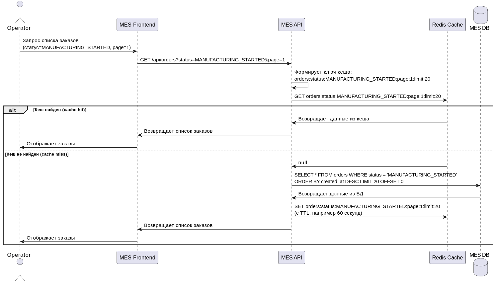
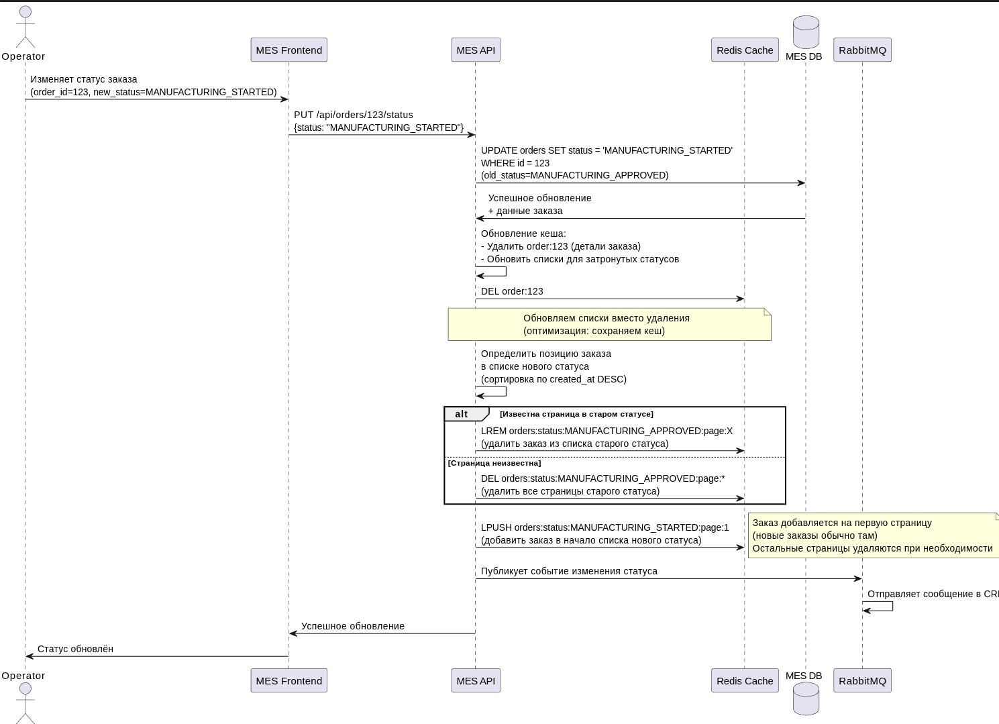

# Архитектурное решение по кешированию

## Мотивация

### Проблемы, которые решает кеширование

Компания «Александрит» столкнулась с критическими проблемами производительности:

1. **Медленная загрузка MES дашборда** — операторы жалуются, что первая страница MES долго прогружается. На странице отображается список заказов в работе по статусам. Команда уже пыталась оптимизировать: добавили фильтр по статусам и пагинацию, но это не помогло. Операторам критично видеть самые новые заказы, так как от этого зависит их вознаграждение.

2. **Рост нагрузки** — компания получает на 100 заказов больше каждый месяц. При открытии внешнего API нагрузка резко выросла, что усугубило проблемы производительности.

3. **Недовольство клиентов** — новые клиенты недовольны скоростью выполнения заказа, компания уже потеряла несколько крупных контрактов.

### Почему нужно внедрить кеширование

**Текущая ситуация:**
- MES API при каждом запросе списка заказов выполняет тяжёлые запросы к PostgreSQL
- При росте количества заказов время выполнения запросов растёт линейно
- Операторы часто обновляют страницу, чтобы увидеть новые заказы, что создаёт дополнительную нагрузку на БД
- Отсутствие кеширования приводит к избыточной нагрузке на базу данных

**Что даст кеширование:**
- Снижение нагрузки на БД за счёт уменьшения количества запросов
- Ускорение отклика дашборда для операторов (с секунд до миллисекунд)
- Улучшение масштабируемости системы при росте нагрузки
- Снижение риска деградации производительности при пиковых нагрузках

### Элементы системы для кеширования

**Критично для кеширования:**

1. **Список заказов в MES (дашборд)** — основная проблема производительности
   - Запросы фильтруются по статусам
   - Операторы часто обновляют страницу для поиска новых заказов
   - Данные читаются гораздо чаще, чем изменяются

2. **Детали заказа в MES** — часто запрашиваются операторами для просмотра информации о заказе

**Важно для кеширования:**

3. **Список товаров в Shop API** — относительно статичные данные, часто запрашиваются клиентами

4. **Список заказов в CRM** — продавцы часто просматривают заказы, но данные изменяются чаще, чем в MES

**Не кешируем:**
- Расчёт стоимости заказа — уникальная операция для каждого заказа, зависит от 3D-модели
- Изменение статусов заказа — операции записи, кеширование не применимо
- 3D-файлы — большие объёмы данных, лучше хранить в S3 с CDN

---

## Предлагаемое решение

### Выбор типа кеширования: серверное кеширование

**Выбранное решение: серверное кеширование (Redis)**

**Почему серверное, а не клиентское:**

| Критерий | Серверное кеширование | Клиентское кеширование |
|----------|----------------------|------------------------|
| **Контроль актуальности данных** | ✅ Полный контроль на сервере, единая точка инвалидации | ❌ Нет контроля, каждый клиент может иметь устаревшие данные |
| **Сложность реализации** | ✅ Проще — один слой кеширования на бэкенде | ❌ Сложнее — нужно управлять кешем на каждом клиенте |
| **Эффективность** | ✅ Один запрос к кешу обслуживает всех клиентов | ❌ Каждый клиент хранит свои данные, дублирование |
| **Актуальность для операторов** | ✅ Критично — операторам нужны самые свежие данные о новых заказах | ❌ Клиентский кеш может показывать устаревшие данные |
| **Масштабируемость** | ✅ Централизованный кеш легко масштабировать | ❌ Сложнее масштабировать, нужно синхронизировать между клиентами |

**Обоснование:** Для MES дашборда критично, чтобы все операторы видели актуальные данные о новых заказах (от этого зависит их вознаграждение). Клиентское кеширование не обеспечивает достаточный контроль актуальности данных. Серверное кеширование даёт единую точку управления и гарантирует консистентность данных для всех пользователей.

### Выбор паттерна кеширования: Cache-Aside

**Почему Cache-Aside:**

| Паттерн | Описание | Почему подходит | Почему не подходят другие |
|---------|----------|-----------------|---------------------------|
| **Cache-Aside** | Приложение само управляет кешем: проверяет кеш, при промахе читает из БД и записывает в кеш | ✅ Простота реализации и понимания ✅ Гибкость — можно кешировать только нужные данные ✅ Устойчивость к сбоям кеша (при падении Redis приложение продолжит работать через БД) ✅ Легко добавить в существующий код без больших изменений | — |
| **Write-Through** | Запись всегда идёт и в БД, и в кеш одновременно | ❌ Сложнее реализация ❌ При каждом изменении статуса заказа нужно обновлять кеш, даже если данные не читаются ❌ Избыточные операции записи в кеш ❌ Требует больше изменений в коде | Cache-Aside проще и эффективнее для read-heavy нагрузки |
| **Refresh-Ahead** | Кеш обновляется заранее до истечения TTL | ❌ Сложная реализация ❌ Нужно предсказывать, какие данные будут запрошены ❌ Избыточные запросы к БД для данных, которые могут не понадобиться ❌ Для MES дашборда сложно предсказать, какие именно заказы будут запрошены | Cache-Aside проще и не требует предсказаний |

**Обоснование:** 
- MES дашборд — это read-heavy нагрузка (операторы часто читают, редко изменяют)
- Cache-Aside идеально подходит для такого сценария: кешируем при чтении, инвалидируем при изменении
- Простота реализации критична для маленькой команды
- Устойчивость к сбоям кеша важна для production системы

### Архитектура решения

**Компоненты:**
- **Redis** — in-memory хранилище для кеша (развернуть как отдельный сервис)
- **MES API** — добавляется логика работы с кешем (библиотека для C#: StackExchange.Redis)
- **Ключи кеша:** `orders:status:{status}:page:{page}:limit:{limit}` для списков заказов, `order:{order_id}` для деталей заказа

**Диаграммы последовательности:**

#### Чтение списка заказов (Cache-Aside)

Диаграмма показывает процесс чтения списка заказов с использованием паттерна Cache-Aside:
1. MES API проверяет наличие данных в Redis по ключу
2. При cache hit — возвращает данные из кеша (быстро, < 10 мс)
3. При cache miss — читает из БД, сохраняет в кеш с TTL и возвращает данные

#### Запись изменения статуса заказа (инвалидация кеша)

Диаграмма показывает процесс обновления кеша при изменении статуса заказа:
1. MES API обновляет данные в БД
2. Обновляет кеш:
   - Удаляет детали заказа (`order:{order_id}`)
   - Обновляет списки заказов для затронутых статусов:
     - Удаляет заказ из списка старого статуса
     - Добавляет заказ в список нового статуса в правильную позицию
3. Публикует событие в RabbitMQ для синхронизации с другими системами

**Оптимизация:** Вместо удаления списков целиком они обновляются — заказ удаляется из старого списка и добавляется в новый. Это сохраняет кеш и обеспечивает мгновенное отображение изменений для операторов.

### Стратегия инвалидации кеша

**Выбранная стратегия: комбинированная (обновление кеша по ключу + временная TTL)**

**Компоненты стратегии:**

1. **Обновление кеша (программное)** — при изменении данных
   - При изменении статуса заказа обновляются только затронутые ключи кеша:
     - Удаляется кеш деталей заказа (`order:{order_id}`) — будет пересоздан при следующем запросе
     - **Обновляются списки заказов** для затронутых статусов (вместо полного удаления):
       - Из списка старого статуса (old_status) удаляется заказ
       - В список нового статуса (new_status) добавляется заказ в правильную позицию (с учётом сортировки)
   - **Преимущество:** Списки остаются в кеше, операторы видят изменения сразу, без необходимости пересоздания кеша
   - **Ограничение:** Нужно знать, на какой странице находится заказ в старом статусе (можно использовать дополнительный индекс или удалять все страницы старого статуса, если позиция неизвестна)

2. **Временная инвалидация (TTL)** — на случай потери сообщений или других сбоев
   - TTL для списков заказов: **60 секунд** — баланс между актуальностью и нагрузкой
   - TTL для деталей заказа: **300 секунд (5 минут)** — детали меняются реже

**Почему комбинированная стратегия:**

| Стратегия | Описание | Почему подходит | Почему не подходят другие |
|-----------|----------|-----------------|---------------------------|
| **Комбинированная (обновление + TTL)** | Обновление кеша при изменении + TTL на случай сбоев | ✅ Гарантирует актуальность при нормальной работе (обновление кеша) ✅ Сохраняет кеш — списки не удаляются, а обновляются ✅ Операторы видят изменения мгновенно ✅ Защита от устаревших данных при сбоях (TTL) ✅ Учитывает асинхронную природу системы (RabbitMQ может потерять сообщение) | — |
| **Только временная (TTL)** | Только TTL, без программной инвалидации | ❌ При изменении статуса данные остаются в кеше до истечения TTL ❌ Операторы могут не видеть новые заказы до 60 секунд ❌ Критично для бизнеса (вознаграждение операторов) | Недостаточная актуальность данных |
| **Только по ключу (программная)** | Только инвалидация при изменении, без TTL | ❌ При потере сообщения RabbitMQ кеш не обновится ❌ При сбое в логике инвалидации данные могут устареть навсегда ❌ Нет защиты от багов в коде | Нет защиты от сбоев |
| **Только по событию** | Инвалидация только при получении события из RabbitMQ | ❌ Зависимость от RabbitMQ — при потере сообщения кеш не обновится ❌ Сложнее реализация (нужен консьюмер событий) ❌ Дополнительная точка отказа | Cache-Aside проще и надёжнее |

**Обоснование:**
- **Обновление кеша** обеспечивает мгновенное отображение изменений для операторов — критично для бизнеса (вознаграждение зависит от новых заказов)
- **Сохранение кеша** вместо удаления повышает эффективность — списки остаются в кеше, снижается нагрузка на БД
- **TTL** защищает от ситуаций, когда сообщение RabbitMQ потерялось или логика обновления не сработала
- Комбинация даёт баланс между актуальностью данных, производительностью и устойчивостью к сбоям
- TTL 60 секунд — разумный компромисс: операторы получат актуальные данные мгновенно при обновлении, но даже при сбое данные обновятся в течение минуты

**Реализация обновления кеша:**
- При изменении статуса заказа в MES API:
  1. Удаляется кеш деталей заказа: `DEL order:{order_id}`
  2. Обновляются списки для затронутых статусов:
     - **Для старого статуса (old_status):**
       - Если известна страница заказа: удаляем заказ из конкретной страницы списка
       - Если страница неизвестна: удаляем все страницы старого статуса (fallback)
     - **Для нового статуса (new_status):**
       - Определяем правильную позицию заказа (с учётом сортировки по `created_at DESC`)
       - Определяем страницу, на которую попадает заказ
       - Добавляем заказ в список на нужной странице
       - Если список на странице не существует в кеше — не создаём (будет создан при запросе)
  3. Используется Redis pipeline для batch-операций (оптимизация производительности)
   
**Компромисс для упрощения:**
- Если определение точной позиции заказа сложно, можно использовать гибридный подход:
  - Удалять все страницы старого статуса (гарантированная актуальность)
  - Обновлять только первую страницу нового статуса (где обычно появляются новые заказы)
  - Остальные страницы нового статуса удаляются (будут пересозданы при запросе)

---

## Сравнительный анализ решений

### Сравнение паттернов кеширования

| Критерий | Cache-Aside | Write-Through | Refresh-Ahead |
|----------|-------------|--------------|--------------|
| **Простота реализации** | ✅ Простая — проверка кеша, чтение из БД при промахе | ⚠️ Средняя — нужно синхронизировать запись в БД и кеш | ❌ Сложная — нужна логика предсказания |
| **Производительность при чтении** | ✅ Отличная — кеш используется эффективно | ✅ Отличная | ⚠️ Может быть избыточной — обновление данных, которые не запрашиваются |
| **Производительность при записи** | ✅ Не влияет — запись не затрагивает кеш напрямую | ❌ Медленнее — каждая запись обновляет кеш | ✅ Не влияет |
| **Устойчивость к сбоям** | ✅ Высокая — при падении кеша приложение работает через БД | ⚠️ Средняя — запись может замедлиться при проблемах с кешем | ✅ Высокая |
| **Актуальность данных** | ✅ Высокая при правильной инвалидации | ✅ Высокая — кеш всегда синхронизирован | ⚠️ Зависит от TTL |
| **Подходит для read-heavy** | ✅ Идеально | ⚠️ Подходит, но избыточно | ❌ Не оптимально |
| **Подходит для MES дашборда** | ✅ Да — операторы часто читают, редко изменяют | ❌ Нет — избыточные операции записи | ❌ Нет — сложно предсказать, какие заказы нужны |

**Вывод:** Cache-Aside — оптимальный выбор для MES дашборда с read-heavy нагрузкой.

### Сравнение стратегий инвалидации

| Критерий | Комбинированная (обновление + TTL) | Только TTL | Только удаление списков | Только по событию |
|----------|-----------------------------------|------------|------------------------|-------------------|
| **Актуальность данных** | ✅ Максимальная — мгновенное обновление списков + защита TTL | ⚠️ Средняя — зависит от TTL (до 60 сек задержка) | ✅ Высокая — мгновенная инвалидация | ✅ Высокая при нормальной работе |
| **Эффективность кеша** | ✅ Максимальная — списки обновляются, не удаляются | ✅ Хорошая | ⚠️ Средняя — списки удаляются, нужно пересоздавать | ✅ Хорошая |
| **Устойчивость к сбоям** | ✅ Высокая — TTL защищает от потери сообщений | ✅ Высокая | ❌ Низкая — при сбое данные могут устареть | ❌ Низкая — зависит от RabbitMQ |
| **Простота реализации** | ⚠️ Средняя — нужно реализовать обновление списков и TTL | ✅ Простая | ✅ Простая — просто удаление | ❌ Сложная — нужен консьюмер событий |
| **Производительность** | ✅ Отличная — кеш сохраняется, минимум запросов к БД | ✅ Хорошая | ⚠️ Средняя — после удаления нужен пересоздание кеша | ⚠️ Может быть задержка из-за асинхронности |
| **Защита от потери сообщений RabbitMQ** | ✅ Есть — TTL обновит кеш даже при потере сообщения | ✅ Есть | ❌ Нет | ❌ Нет |
| **Подходит для MES** | ✅ Да — оптимальный баланс актуальности, эффективности и надёжности | ❌ Нет — задержка критична для операторов | ⚠️ Частично — нет защиты от сбоев, менее эффективно | ⚠️ Частично — зависимость от RabbitMQ |

**Вывод:** Комбинированная стратегия с обновлением списков (вместо удаления) обеспечивает оптимальный баланс между актуальностью данных, эффективностью кеша и устойчивостью к сбоям для критически важного MES дашборда. Списки остаются в кеше и обновляются, что снижает нагрузку на БД и обеспечивает мгновенное отображение изменений для операторов.

